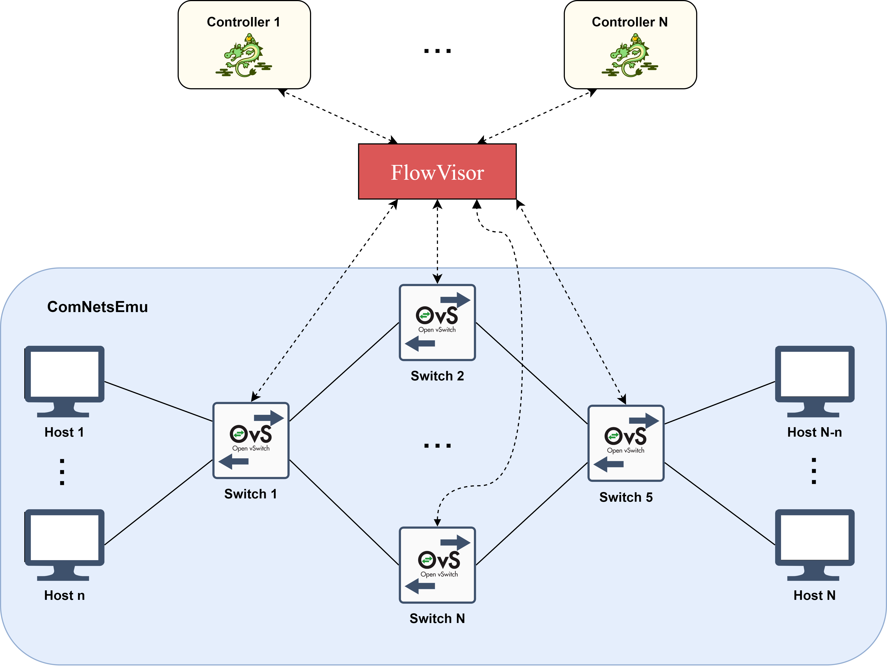
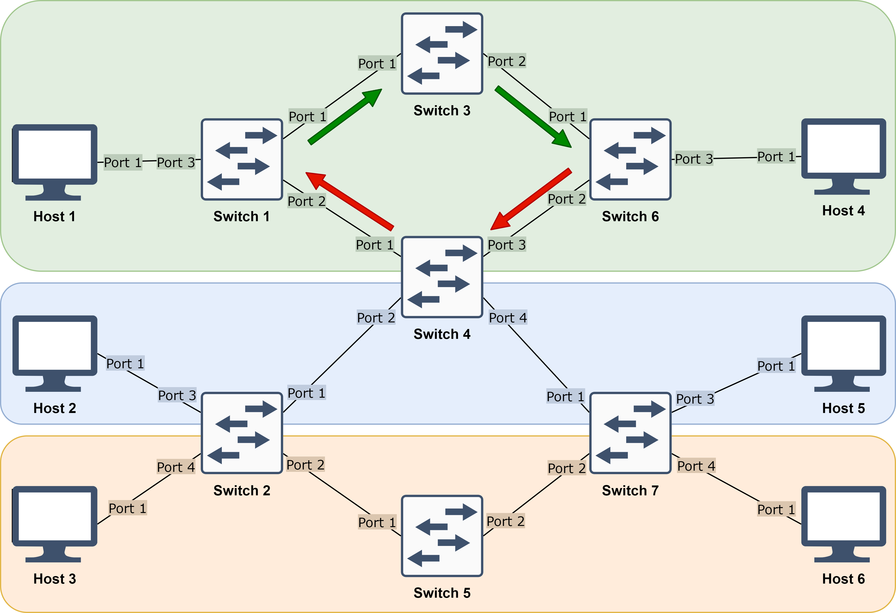
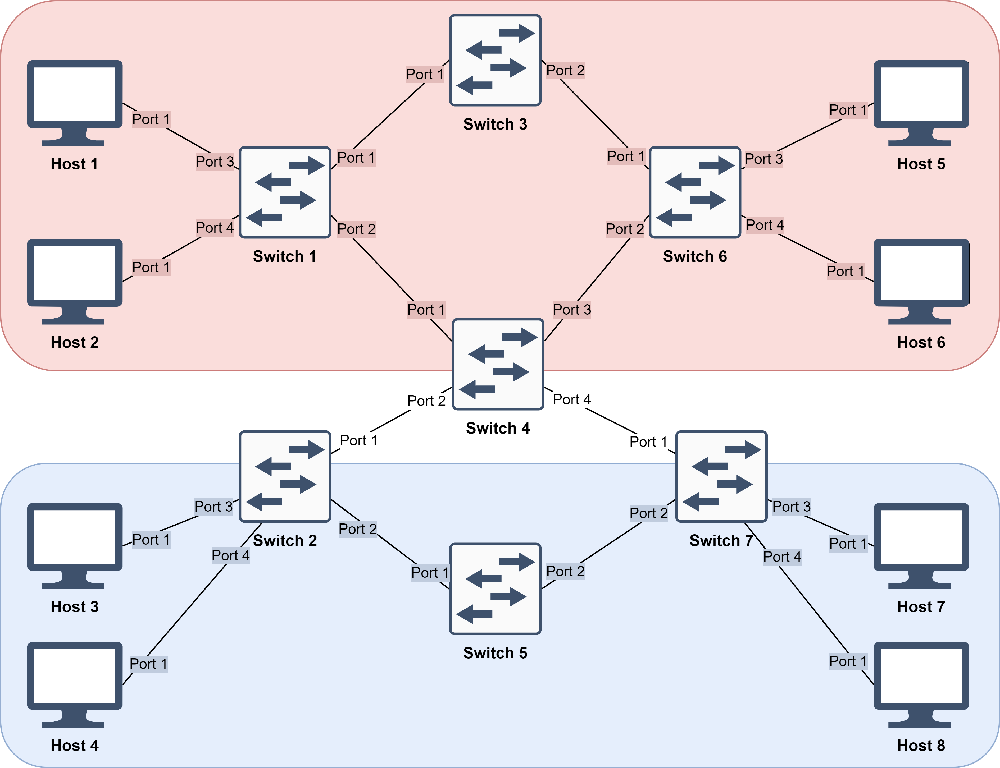

# Multi-tenant SDN Slicing in ComNetsEmu
Softwarized and Virtualized Mobile Networks A.Y. 2019/2020 - UniTN

Andrea Abriani - MAT 214978  
Fabio Della Giustina - MAT 214979  
Davide Gagliardi - MAT 214958

## Building blocks

- **Open vSwitch (v2.7)**: open-source multi-layer virtual switch manager that allows the communication between "dumb switches" and controllers.
- **RYU (v4.34)**: component-based Software Defined Networking framework implemented in Python that provides a simple way to define control functionalities for an OpenFlow controller.
- **FlowVisor (v1.4)**: special purpose OpenFlow controller that acts as a transparent proxy between OpenFlow switches and multiple OpenFlow controllers.

## Implementation

- **Topology** (hosts and switches): defined in ComNetsEmu.
- **FlowVisor** (core controller): stands in between the switches and the tenant controllers; defines the slices to which one RYU controller is assigned each (enabling multi-tenancy); policy checks each OpenFlow message that goes through it, checking permissions related to the policies defined.
- **RYU controllers** (tenant controllers): defined in ComNetsEmu.

*Note*: FlowVisor v1.4 (last open-source version available) is based on OpenFlow 1.0, thus both the Open vSwitch switches and the RYU controllers need to be set up working with OpenFlow 1.0.

### Integrating FlowVisor in ComNetsEmu

<<<<<<< HEAD
What is crucial is to integrate FlowVisor into the ComNetsEmu environment, since FlowVisor is quite old and outdated. For this reason, FlowVisor is implemented in a Docker container running an old CentOS image with an old version of Java, required by FlowVisor.

## First topology

The first topology presents 3 slices, namely upper, middle and lower slice. FlowVisor is programmed to topology slice, working on a physical port level.

In the upper slice, the tenant controller forwards traffic based on the direction (Left-to-Right and Right-to-Left, through Switch 3 and Switch 4 respectively).

In both the middle and lower slice, a simple forwarding is implemented by the related tenant controllers, with the difference that flows are installed on the switch during the configuration phase (between tenant controller and switch) for the former and later during the operational phase for the latter.

## Second topology

The second topology presents 2 slices, namely upper and lower slice.

In the upper slice, the tenant controller discriminates traffic based on whether the flows are UDP flows on port 9999. If that is the case, traffic will pass through Switch 3, otherwise traffic will pass through Switch 4.

In the lower slice, the tenant controller applies packet flooding for all traffic flowing through the switches.
=======
Since FlowVisor is quite old and outdated, it needs to be implemented in a Docker container running an old CentOS image with an old version of Java (required by FlowVisor).
>>>>>>> 08fc83f66ac200cbcac17a43a6b17bb0903267be
