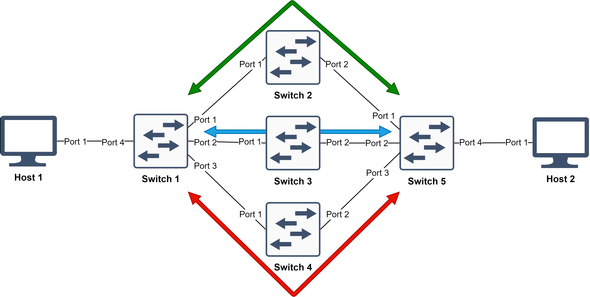
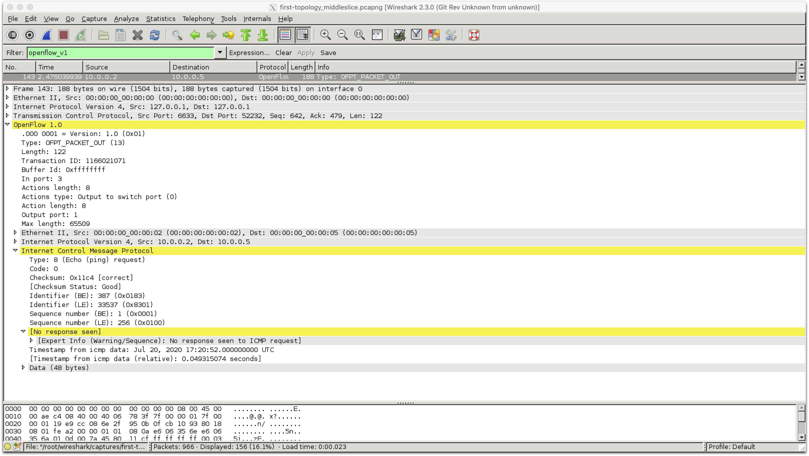

# Multi-tenant SDN Slicing in ComNetsEmu
Softwarized and Virtualized Mobile Networks A.Y. 2019/2020 - UniTN

Andrea Abriani - MAT 214978  
Fabio Della Giustina - MAT 214979  
Davide Gagliardi - MAT 214958


## Building blocks

- **Open vSwitch (v2.7)**: open-source multi-layer virtual switch manager that allows the communication between "dumb switches" and controllers.
- **RYU (v4.34)**: component-based Software Defined Networking framework implemented in Python that provides a simple way to define control functionalities for an OpenFlow controller.
- **FlowVisor (v1.4)**: special purpose OpenFlow controller that acts as a transparent proxy between OpenFlow switches and multiple OpenFlow controllers.


## Implementation


- **Topology** (hosts and switches): defined in ComNetsEmu.
- **FlowVisor** (core controller): stands in between the switches and the tenant controllers; defines the slices to which one RYU controller is assigned each (enabling multi-tenancy); policy checks each OpenFlow message that goes through it, checking permissions related to the policies defined.
- **RYU controllers** (tenant controllers): defined in ComNetsEmu.

*Note*: FlowVisor v1.4 (last open-source version available) is based on OpenFlow 1.0, thus both the Open vSwitch switches and the RYU controllers need to be set up working with OpenFlow 1.0.

### Integrating FlowVisor in ComNetsEmu

Since FlowVisor is quite old and outdated, it needs to be implemented in a Docker container running an old CentOS image with an old version of Java (required by FlowVisor).

## Topologies
### First topology


The first topology presents 3 slices, namely upper, middle and lower slice. FlowVisor is programmed to topology slice, working on a physical port level.

In the upper slice, the tenant controller forwards traffic based on the direction (Left-to-Right and Right-to-Left, through Switch 3 and Switch 4 respectively).

In both the middle and lower slice, a simple forwarding is implemented by the related tenant controllers, with the difference that flows are installed on the switch during the configuration phase (between tenant controller and switch) for the former and later during the operational phase for the latter.

#### Demo
##### First Scenario Commands

First, run the VM with the command `vagrant up comnetsemu` and log in `vagrant ssh comnetsemu`.

##### Mininet
Set up the whole environment with Mininet. Navigate to the correct folder and run the mininet script:
```bash
vagrant@comnetsemu:~$  cd comnetsemu/SVMN_project/1st_scenario
vagrant@comnetsemu:~/comnetsemu/SVMN_project/1st_scenario $ sudo mn -c #to flush eventual previous configurations
vagrant@comnetsemu:~/comnetsemu/SVMN_project/1st_scenario $ sudo python3 first-topology.py
```
##### Flowvisor
In a new terminal, run the Flowvisor container with the following commands:
```bash
vagrant@comnetsemu:~$ cd comnetsemu/SVMN_project/flowvisor

#If it's the first time you need to build the flowvisor image, typing this command
vagrant@comnetsemu:~/comnetsemu/SVMN_project/flowvisor $ ./build_flowvisor_image.sh

#Then you will be able to launch the container
vagrant@comnetsemu:~/comnetsemu/SVMN_project/flowvisor $ ./run_flowvisor_container.sh

#Launch the Flowvisor script to set up the slices, press ENTER when a password for the slice is required
[root@comnetsemu ~] cd slicing_scripts
[root@comnetsemu slicing_scripts] ./1st-flowvisor_slicing.sh


```

##### Setup Controllers

Open three different terminal windows, log into the VM and navigate to the correct folder with the command `cd comnetsemu/SVMN_project/1st_scenario`.
Then you will be able to run the controllers.

Run UpperSlice Controller:


```bash
vagrant@comnetsemu:~/comnetsemu/SVMN_project/1st_scenario $ ryu run --observe-links --ofp-tcp-listen-port 10001 --wsapi-port 8082 /usr/local/lib/python3.6/dist-packages/ryu/app/gui_topology/gui_topology.py ryu-upperslice.py
```

Run MiddleSlice Controller:
```bash
vagrant@comnetsemu:~/comnetsemu/SVMN_project/1st_scenario $ ryu run --observe-links --ofp-tcp-listen-port 10002 --wsapi-port 8083 /usr/local/lib/python3.6/dist-packages/ryu/app/gui_topology/gui_topology.py ryu-middleslice.py
```

Run LowerSlice Controller:
```bash
vagrant@comnetsemu:~/comnetsemu/SVMN_project/1st_scenario $ ryu run --observe-links --ofp-tcp-listen-port 10003 --wsapi-port 8084 /usr/local/lib/python3.6/dist-packages/ryu/app/gui_topology/gui_topology.py ryu-lowerslice.py
```
It is possible to check the status of the infrastructure opening a browser tab with the following addressed:
- Upper slice: [0.0.0.0:8082](http://0.0.0.0:8082)
- Middle slice: [0.0.0.0:8083](http://0.0.0.0:8083)
- Lower slice: [0.0.0.0:8084](http://0.0.0.0:8084)


##### UpperSlice Concept Demonstration

Run a ping:
```bash
mininet> h1 ping h4
```

Show flows actually inserted in Switch 3 and Switch 4 (left-right and right-left flow only respectively)
```bash
sudo ovs-ofctl dump-flows s3
sudo ovs-ofctl dump-flows s4
```


##### MiddleSlice Concept Demonstration

Run simple command  (assesses flow entry applied correctly at config phase)
```bash
mininet> h2 ping h5
```


##### LowerSlice Concept Demonstration

Run simple command  (demonstrates flow entry applied correctly at main phase, but packet_out message generates error in related switch)
```bash
mininet> h3 ping h6
```
Before moving to a next scenario it is strongly recommended to flush everything with the command `sudo mn -c` and stop the VM with `vagrant halt comnetsemu`.


### Second topology


The second topology presents 2 slices, namely upper and lower slice.

In the upper slice, the tenant controller discriminates traffic based on whether the flows are UDP flows on port 9999. If that is the case, traffic will pass through Switch 3, otherwise traffic will pass through Switch 4.

In the lower slice, the tenant controller applies packet flooding for all traffic flowing through the switches.

#### Demo


### Third topology



The third topology uses a different approach. Indeed, FlowVisor implements a service slicing mechanism than a topology slicing one. Thus, FlowVisor assigns different traffic to different slices based on the kind of traffic flowing (even through the same port). This is done discriminating onto the type of protocol or port used.

In this scenario, 3 different tenant controllers, when independently called by FlowVisor, redirect traffic through a different intermediate switch. Namely, the upper slice controller is called to handle TCP traffic on port 9999, the middle one to handle UDP traffic on port 9998 and the lower one to handle all the other traffic.

#### Demo

## Known issues

An issue was found during the project. It is related to the forwarding OpenFlow packet_out messages when commanded by the OpenFlow tenant controller to the switches. This kind of error takes place only in switches that are shared among two or more slices on the FlowVisor definition. More specifically, the pattern we found shows no issues on the first controller assigned to the shared switch, instead manifesting itself for all subsequent controllers assigned to it within FlowVisor.

As an example, this issue may arise in the First topology exposed, from the handling by the middle slice tenant controller to command a packet_out message to Switch 4 (which is shared with the upper slice). That would generate an error, illustrated below, of type "bad permissions" on the switch.

```bash
EVENT ofp_event->NoFlowEntry EventOFPPacketIn
INFO packet arrived in s4 (in_port=2)
INFO sending packet from s4 (out_port=4)
EventOFPErrorMsg received.
version=0x1, msg_type=0x1, msg_len=0x6a, xid=0x0
 `-- msg_type: OFPT_ERROR(1)
OFPErrorMsg(type=0x2, code=0x6, data=b'\x01\x0d\x00\x5e\xa8\x8c\x25\x6d\xff\xff\xff\xff\x00\x02\x00\x08\x00\x00\x00\x08\x00\x04\xff\xe5\x33\x33\x00\x00\x00\x02\x8a\x52\x84\x58\x39\x17\x86\xdd\x60\x00\x00\x00\x00\x10\x3a\xff\xfe\x80\x00\x00\x00\x00\x00\x00\x88\x52\x84\xff\xfe\x58\x39\x17\xff\x02\x00\x00\x00\x00\x00\x00\x00\x00\x00\x00\x00\x00\x00\x02\x85\x00\xef\xa9\x00\x00\x00\x00\x01\x01\x8a\x52\x84\x58\x39\x17')
 |-- type: OFPET_BAD_ACTION(2)
 |-- code: OFPBAC_EPERM(6)
 `-- data: version=0x1, msg_type=0xd, msg_len=0x5e, xid=0xa88c256d
     `-- msg_type: OFPT_PACKET_OUT(13)
```

Even analyzing the behaviour thanks to Wireshark we integrated into the VM, we have not been able to tackle further this issue. On Wireshark a missing ICMP response highlights when dissecting the packet_out message information, but still the same situation happens also on the upper slice, which instead runs unaffected.



It is worth noting that the whole project was developed only on a L2 level, ignoring the packet loss checking that is usually performed by applications on the application level.
Without considering that, as an escamotage, on the problematic slices the forwarding rules are assigned on the configuration phase between tenant controller and switch, in order to avoid the loss of the first packets that would otherwise not be sent back from the switch because of the issue (as implemented for the middle controller of the First topology).
As another solution, it may have been interesting to evaluate the outcome when adopting the packet buffering on the switch, thus avoiding the sending of packet data back and forth between the controller and switch. However, this was not possible because the OpenvSwitch version used in the switches (Open vSwitch v2.7), is lacking the buffering feature (removed from Open vSwitch v2.5). On the other hand, we did not proceed to downgrade OpenvSwitch in order to avoid further problematics that may arise from it.
